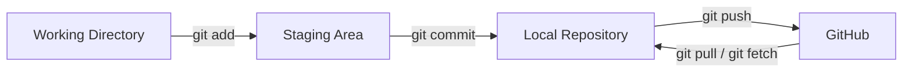

# Git Workflow


---

# 1. Introduction

A **Git Workflow** is the sequence of steps developers follow to track, save, and share changes in a project.

Git provides a structured workflow that ensures every change is recorded, organized, and can be restored if needed.

A typical Git workflow consists of four stages:

1. Working Directory
2. Staging Area
3. Local Repository
4. Remote Repository (GitHub)

---

# 2. Why Do We Need a Git Workflow?

Without a workflow:

- Changes could be lost.
- Developers might overwrite each other's work.
- It becomes difficult to identify bugs.
- There is no organized project history.

A Git workflow provides consistency and helps teams collaborate efficiently.

---

# 3. Git Workflow Diagram



---

# 4. Step 1 – Working Directory

The Working Directory is where you create, edit, delete, and rename files.

Example:

```
Student.java
README.md
pom.xml
```

Changes made here are not yet part of Git's history.

---

# 5. Step 2 – Staging Area

Use:

```bash
git add .
```

or

```bash
git add Student.java
```

The selected changes move to the Staging Area.

The Staging Area allows you to choose exactly what should be included in the next commit.

---

# 6. Step 3 – Local Repository

Use:

```bash
git commit -m "Add Student class"
```

Git creates a commit and stores it in the Local Repository.

The commit is saved on your computer.

---

# 7. Step 4 – Remote Repository (GitHub)

Use:

```bash
git push
```

Git uploads your local commits to GitHub.

Now your project is backed up online and can be shared with others.

---

# 8. Complete Example

Create a new file:

```bash
touch Student.java
```

Check status:

```bash
git status
```

Stage the file:

```bash
git add Student.java
```

Commit:

```bash
git commit -m "Add Student class"
```

Push:

```bash
git push
```

The complete workflow is now finished.

---

# 9. Real-Life Example

Imagine you're writing an assignment.

- **Working Directory** → Writing and editing the assignment.
- **Staging Area** → Selecting the pages you want to submit.
- **Local Repository** → Saving the final assignment on your laptop.
- **GitHub** → Uploading the assignment to Google Drive for backup and sharing.

---

# 10. Common Commands

| Command | Purpose |
|---------|---------|
| `git status` | Check current status |
| `git add` | Move changes to the Staging Area |
| `git commit` | Save staged changes |
| `git push` | Upload commits to GitHub |
| `git pull` | Download the latest changes from GitHub |

---

# 11. Common Mistakes

### Forgetting to stage changes

Running:

```bash
git commit -m "Update"
```

without:

```bash
git add .
```

will not include new or modified files that haven't been staged.

---

### Thinking `git commit` uploads code

`git commit` saves changes only in the Local Repository.

You still need:

```bash
git push
```

---

### Forgetting to pull before pushing

If someone else has pushed changes to GitHub, you should first run:

```bash
git pull
```

before pushing your own changes.

---

# 12. Interview Questions

### Basic

- What is the Git workflow?
- What are the four stages of the Git workflow?

### Intermediate

- What is the purpose of the Staging Area?
- What is the difference between `git commit` and `git push`?

### Advanced

- Explain the complete Git workflow with an example.
- Why does Git use a Staging Area instead of committing directly?

---

# 13. Key Takeaways

- The Git workflow follows a fixed sequence.
- Changes begin in the Working Directory.
- `git add` moves changes to the Staging Area.
- `git commit` saves them in the Local Repository.
- `git push` uploads commits to GitHub.

---

# Quick Revision

```
Working Directory
        │
    git add
        │
        ▼
 Staging Area
        │
   git commit
        │
        ▼
Local Repository
        │
    git push
        │
        ▼
GitHub
```

Remember this flow—it is the foundation of Git.